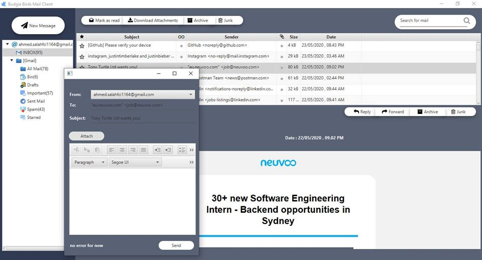

# Budgie-Mail-Client
Budgie Mail Client is a java mail client desktop app that can send and recieve mails from multiple accounts and track new mails from many accounts like windows mail client , Mozilla Thunderbird and so on.

